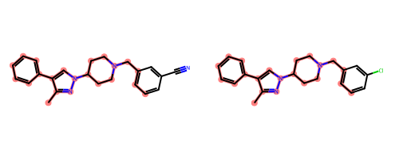

# GESim

## How to setup

### Requirements

- Python: >= 3.11
- gcc: 11.3.1 (or later)
- rdkit: 2023.9.1
- pybind11: 2.11.1

### Installation

```bash
pip install --upgrade git+https://github.com/LazyShion/GESim.git
```

## How to use

### Calculate similarity

```python
from rdkit import Chem
from gesim import gesim

mol1 = Chem.MolFromSmiles('Cc1nn(C2CCN(Cc3cccc(C#N)c3)CC2)cc1-c1ccccc1')
mol2 = Chem.MolFromSmiles('Cc1nn(C2CCN(Cc3cccc(Cl)c3)CC2)cc1-c1ccccc1')
mols = [mol1, mol2, Chem.MolFromSmiles('c1ccc(CN2CCC(n3nccc3-c3ccccc3)CC2)cc1')]

print(gesim.graph_entropy_similarity(mol1, mol2))
# 0.9580227325517037
print(gesim.graph_entropy_similarity_batch(mol1, mols))
# [1.0, 0.9580227325517037, 0.7766178810633495]
```

### Visualize matched atoms

```python
from rdkit import Chem
from rdkit.Chem import Draw

mol1 = Chem.MolFromSmiles('Cc1nn(C2CCN(Cc3cccc(C#N)c3)CC2)cc1-c1ccccc1')
mol2 = Chem.MolFromSmiles('Cc1nn(C2CCN(Cc3cccc(Cl)c3)CC2)cc1-c1ccccc1')

mol1_matched, mol2_matched = gesim.get_matched_mapping_numbers(mol1, mol2)
mol1_hal = [i for i, mv in enumerate(mol1_matched) if mv == 1]
mol2_hal = [i for i, mv in enumerate(mol2_matched) if mv == 1]

Draw.MolsToGridImage([mol1, mol2], highlightAtomLists=[mol1_hal, mol2_hal], molsPerRow=2, useSVG=True, subImgSize=(250, 200))
```




## How to cite

```
@article{Shiokawa2025,
  title = {GESim: Ultrafast Graph-Based Molecular Similarity Calculation via von Neumann Graph Entropy},
  url = {http://dx.doi.org/10.26434/chemrxiv-2025-gm6vk},
  DOI = {10.26434/chemrxiv-2025-gm6vk},
  publisher = {American Chemical Society (ACS)},
  author = {Shiokawa, Hiroaki and Ishida, Shoichi and Terayama, Kei},
  year = {2025},
  month = jan 
}
```

## Contact

- Hiroaki Shiokawa
- Shoichi Ishida

## License

This package is distributed under the MIT license.
